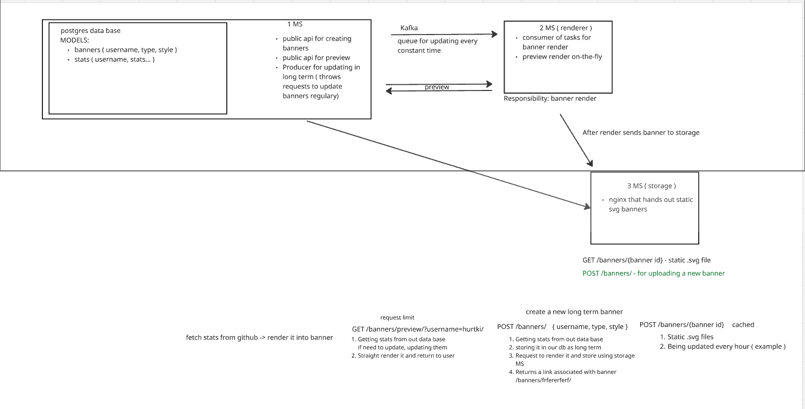

# Architecture Overview

## System Components



## Directory Structure

```
internal/
├── app/
│   └── user_stats/
│       └── worker.go          # Background worker for scheduled updates
├── cache/
│   └── cache.go               # In-memory cache implementation
├── config/
│   ├── config.go              # Main application config
│   ├── kafka.go               # Kafka configuration
│   └── psgr.go                # PostgreSQL configuration
├── domain/
│   ├── banner.go              # Banner types and structures
│   ├── types.go               # GitHub data models
│   ├── errors.go              # Domain errors
│   ├── preview/
│   │   ├── usecase.go         # Preview generation use case
│   │   └── errors.go          # Preview-specific errors
│   └── user_stats/
│       ├── service.go         # Stats service (core business logic)
│       ├── calculator.go      # Statistics calculation
│       ├── models.go          # Service models
│       ├── cache.go           # Cache interface
│       └── interface.go       # Repository/fetcher interfaces
├── handlers/
│   ├── banners.go             # HTTP handlers for /banners/*
│   ├── dto.go                 # Data transfer objects
│   └── error_response.go      # Error response helper
├── infrastructure/
│   ├── db/
│   │   └── connection.go      # PostgreSQL connection
│   ├── github/
│   │   ├── fetcher.go         # GitHub API client with rate limiting
│   │   └── clients_pool.go    # Multiple token client Pool
│   ├── kafka/
│   │   ├── producer.go        # Kafka event producer
│   │   └── dto.go             # Kafka event DTOs
│   ├── renderer/
│   │   ├── renderer.go        # Renderer service HTTP client
│   │   └── dto.go             # Renderer request DTOs
│   │   └── http/
│   │       ├── client.go      # HTTP client factory
│   │       ├── hmac_signer.go # HMAC request signing
│   │       └── round_tripper.go # Auth round tripper
│   └── server/
│       └── server.go          # HTTP server setup
├── logger/
│   └── logger.go              # Structured logging
├── migrations/
│   ├── migrations.go          # Goose migration runner
│   └── *.sql                  # SQL migration files
├── mocks/
│   └── renderer-stats-service-mocks.go
└── repo/
    ├── banners/               # Banner repository (future)
    └── github_user_data/
        ├── storage.go         # Repository struct
        ├── get.go             # Get user data
        ├── save.go            # Save user data
        ├── repos_upsert.go    # Batch upsert repositories
        └── usernames.go       # Get all usernames
```

## Data Flow

### Banner Preview Request

```
1. Client ──▶ GET /banners/preview/?username=X&type=wide

2. Handler ──▶ PreviewUsecase.GetPreview(username, type)

3. PreviewUsecase ──▶ StatsService.GetStats(username)

4. StatsService flow:
   ├─▶ Check cache (in-memory)
   │   └─▶ If fresh (<10min): return cached stats
   │   └─▶ If stale (<24h): return cached, refresh async
   ├─▶ If cache miss: Check database
   │   └─▶ If found: cache it, return stats
   └─▶ If db miss: Fetch from GitHub API
       └─▶ Save to database, cache, return stats

5. PreviewUsecase ──▶ Renderer.RenderPreview(bannerInfo)
   └─▶ HTTP POST to renderer service
   └─▶ Returns SVG image

6. Handler ──▶ Response (image/svg+xml)
```

### Background Worker Flow

```
StatsWorker (runs every hour)
    │
    ▼
RefreshAll(ctx, config)
    │
    ├─▶ Get all usernames from database
    │
    └─▶ For each username (concurrent):
        └─▶ RecalculateAndSync(username)
            ├─▶ Fetch fresh data from GitHub API
            ├─▶ Save to database
            ├─▶ Calculate stats
            └─▶ Update cache
```

## Database Schema

### Users Table

```sql
CREATE TABLE users (
    username TEXT PRIMARY KEY,
    name TEXT,
    company TEXT,
    location TEXT,
    bio TEXT,
    public_repos_count INT NOT NULL,
    followers_count INT,
    following_count INT,
    fetched_at TIMESTAMP NOT NULL
);
```

### Repositories Table

```sql
CREATE TABLE repositories (
    github_id BIGINT PRIMARY KEY,
    owner_username TEXT NOT NULL,
    pushed_at TIMESTAMP,
    updated_at TIMESTAMP,
    language TEXT,
    stars_count INT NOT NULL,
    forks_count INT NOT NULL,
    is_fork BOOLEAN NOT NULL,
    FOREIGN KEY (owner_username) REFERENCES users(username) ON DELETE CASCADE
);
```

### Banners Table (Future)

```sql
CREATE TABLE banners (
    github_username TEXT PRIMARY KEY,
    banner_type TEXT NOT NULL,
    storage_path TEXT NOT NULL,
    is_active BOOLEAN NOT NULL DEFAULT true,
    created_at TIMESTAMP NOT NULL,
    updated_at TIMESTAMP NOT NULL
);
```

## Key Design Patterns

### 1. Clean Architecture / Hexagonal Architecture

- **Domain Layer**: Pure business logic (`domain/`, `domain/user_stats/`, `domain/preview/`)
- **Application Layer**: Use cases and app services (`app/`)
- **Infrastructure Layer**: External services (`infrastructure/`)
- **Interface Layer**: HTTP handlers (`handlers/`)

### 2. Repository Pattern

- `GithubUserDataRepository` interface for data persistence
- PostgreSQL implementation in `repo/github_user_data/`

### 3. Cache-Aside Pattern

- Cache checked first, then database, then external API
- Background refresh for stale data (soft TTL: 10min, hard TTL: 24h)

### 4. Worker Pattern

- Background scheduled tasks via `StatsWorker`
- Concurrent processing with configurable batch size

## External Dependencies

| Service    | Purpose                  | Library                |
| ---------- | ------------------------ | ---------------------- |
| PostgreSQL | Persistent storage       | `jackc/pgx/v5`         |
| GitHub API | User data source         | `google/go-github/v81` |
| Kafka      | Event streaming (future) | `IBM/sarama`           |
| Renderer   | Banner image generation  | HTTP client            |
| Goose      | Database migrations      | `pressly/goose/v3`     |
| Chi        | HTTP routing             | `go-chi/chi/v5`        |
