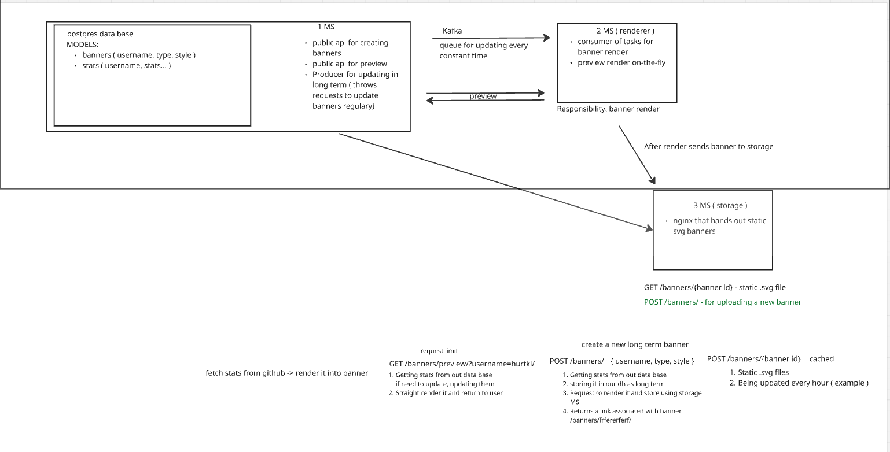

# Architecture Overview

## System Components



### 1. Clean Architecture

- **Domain Layer**: Pure business logic usecases and services (`domain/`, `domain/user_stats/`, `domain/preview/`)
  Define logic
- **Transport Layer**: HTTP handlers (`handlers/`)
  Define API
- **Application Layer** Workers/shedulers (`app/`)
  Define sheduling
- **Infrastructure Layer**: External services domain uses through interfaces (`infrastructure/`)
  "Helpers" for domain logic, doesn't contain any business logic of the service

### 2. Repository Pattern

- github user data repository ( PostgreSQL )
- banners repository ( PostgreSQL )

These repositories use unified `internal/repo/errors.go` to let domain understand errors

### 3. Cache-Aside Pattern with TTL Strategy

- **In-memory cache** checked first, then database, then external API
- **Two-tier TTL**:
  - Soft TTL (10 min): Data considered fresh, returned immediately
  - Hard TTL (24 hours): Data considered stale after soft TTL, returned but async refreshed
- **Preview cache**: Uses hash of BannerInfo (excluding FetchedAt) as key

### 4. Workers

- Background scheduled tasks via `StatsWorker` and `BannersWorker`
- Concurrent processing with configurable concurrency rate ( gorutines count for every update )
- Results/errors collected via channels

### 5. Singleflight Pattern

- `PreviewService` uses singleflight to deduplicate concurrent rendering requests
- Same BannerInfo hash = same request, only one render call

### 6. Client Pool Pattern

- `clients_pool.go` manages multiple GitHub API tokens
- Automatic token rotation based on rate limit status
- Prevents single-token rate limit exhaustion

### 7. Errors flow

- Errors come from domain wrapped using errors from `errors.go` in usecase's package you are using
- For example long-term usecase return errors wrapped with `internal/domain/long-term/errors.go` so handler can understand, what happened
- Important! errors can come with a lot of context, and if it's negative error, it's better to log it, cause it contains a lot of information about the source of error
- But handlers shouldn't just call in as HTTP response err.Error() cause it can give out private service issues

### 8. Username normalization

- When our service calls github api, it will work with usernames in all cases: "hurtki"/"HURTKI"
- So our github data repository is ready for this, with `username_normalized` column, that allows to update table more efficiently and allows constraints to work
- But it still contains `username` filed which contains username with actual case
- Also banners table contains normalized username to restrict creating of two banners with same username
- Also cache for stats uses 

## Main Dependencies

| Service      | Purpose                  | Library                          |
| ------------ | ------------------------ | -------------------------------- |
| PostgreSQL   | Persistent storage       | `jackc/pgx/v5`                   |
| GitHub API   | User data source         | `google/go-github/v81`           |
| Kafka        | Event streaming (future) | `IBM/sarama`                     |
| Renderer     | Banner image generation  | HTTP client                      |
| Storage      | Banner file storage      | HTTP client                      |
| Goose        | Database migrations      | `pressly/goose/v3`               |
| Chi          | HTTP routing             | `go-chi/chi/v5`                  |
| go-cache     | In-memory caching        | `patrickmn/go-cache`             |
| xxhash       | Fast hashing             | `cespare/xxhash/v2`              |
| singleflight | Request deduplication    | `golang.org/x/sync/singleflight` |

## Inter-Service Communication ( not implemented on handlers side )

> Now everything is started in docker compose network, that allows not to secure inter-services communucations

Services will communicate via HTTP with HMAC-based authentication:

```
API Service ──▶ HMAC Signer (signs request with timestamp + secret)
            ──▶ Auth Round Tripper (adds auth headers)
            ──▶ Renderer/Storage Service
```

Headers added:

- `X-Signature`: HMAC-SHA256 of "method[\n]url_path[/n]timestamp[/n]service_name"
- `X-Timestamp`: Unix timestamp
- `X-Service`: Service identifier (e.g., "api")

